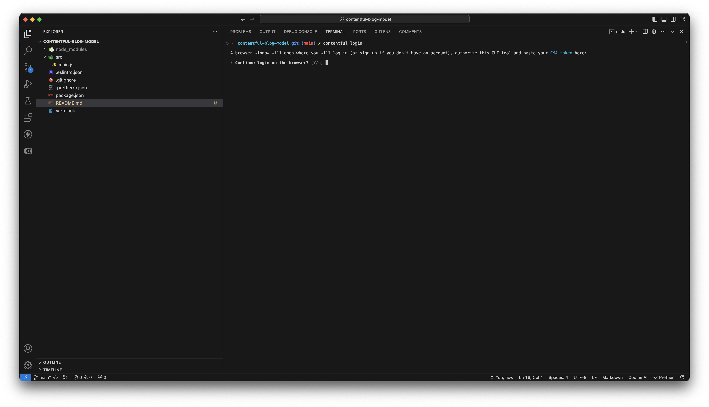
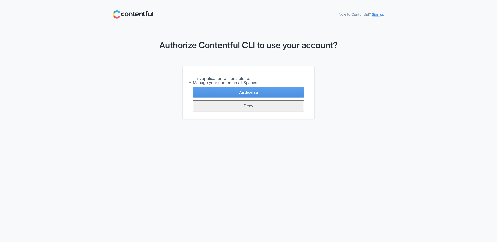
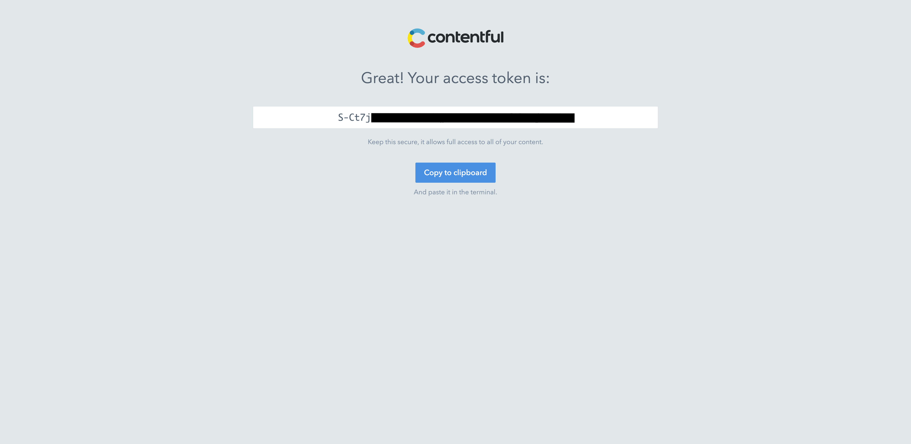
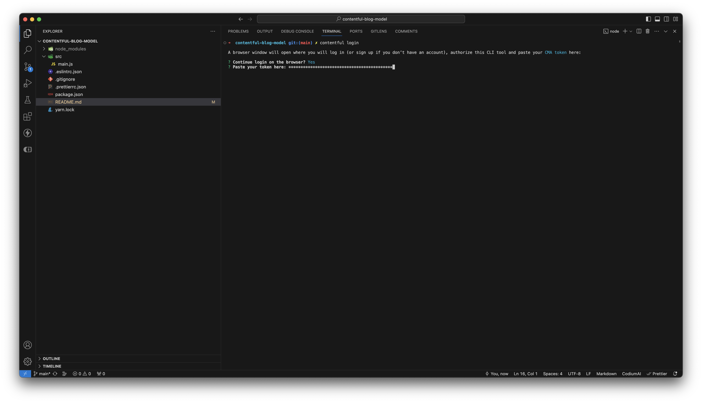
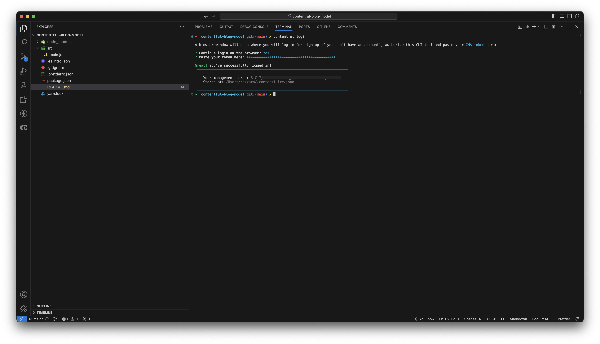

# contentful-blog-model

## Requirements

Install `contentful-cli`

```bash
yarn global add contentful-cli
```

Authentication with the `contentful-cli`

```bash
contentful login
```

Follow steps below

1. Continue login on the browser: Yes
   

2. Authorization
   

3. Once you are authorized, you will be able to see your Content Management Api (CMA) access token
   

4. Paste your CMA token
   

5. You are logged in and your credentials saved in a `.contentfulrc.json` file
   

## How to use

Create an env file from ``.env-EXAMPLE`
```bash
cp .env-ex .env
```

Fill it with your Contentful refs
```bash
export SPACE_ID=jcwrq2qo912t
export ENVIRONMENT_ID=dev
```

Initialize Contentful environemnt with the blog model

```bash
yarn model-import
```

## Troubleshooting

### `zsh: contentful command not found`

Confirm your global bin path (I got: `/home/username/.yarn/bin`)

```bash
yarn global bin
```

Add the following to `~/.bash_profile`, `~/.bashrc` or `~/.zshrc`

```bash
export PATH="$PATH:`yarn global bin`"
```

Restart your shell
